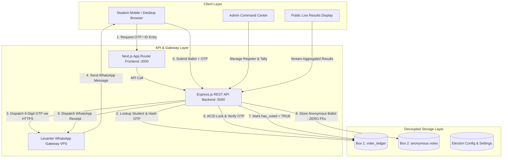

# 🗳️ New Life College (NLC) - Digital Voting System & UI Design Specification

> **Official SRC & Electoral Commission Digital Voting Platform**  
> *A secure, containerized, and secret-ballot election system powered by Next.js, Node.js/Express, MySQL InnoDB ACID Transactions, and Levanter WhatsApp OTP Verification.*

---

## 📌 1. Project Overview & Executive Summary

### 🎯 The Challenge
Historically, student elections at **New Life College (NLC)** relied on manual paper ballots or vulnerable Google Forms setups. These legacy methods suffered from critical vulnerabilities:
- **Voter Impersonation & Ballot Stuffing:** Students could vote multiple times or vote on behalf of absent peers.
- **Privacy Breaches:** Linkage between student identity and candidate selection in standard spreadsheets compromised ballot secrecy.
- **Delayed & Contested Results:** Manual counting led to prolonged collation times and disputes over election integrity.

### 💡 The Solution
The **New Life College Digital Voting System** is an institutional-grade, zero-trust digital voting platform designed to guarantee:
1. **100% Secret Ballot Anonymity:** Complete cryptographic and architectural decoupling of voter identity from cast ballots.
2. **Strict Identity Verification:** Automated OTP delivery directly to each student's pre-registered phone number via the **Levanter WhatsApp API Gateway**.
3. **Atomic Concurrency Protection:** High-speed MySQL InnoDB row-level locking (`SELECT ... FOR UPDATE`) preventing race conditions, double-voting, or duplicate submissions.
4. **Transparent Electoral Control:** Full administrator command center with live turnout telemetry, bulk Excel voter ledger uploads, registration approval queues, and instant results tabulation.

---

## 🏛️ 2. System Architecture & Security Model



### 🛡️ Core Security Pillars
| Security Feature | Mechanism | Guarantee |
|---|---|---|
| **Decoupled "Two-Box" Schema** | `voter_ledger` stores identity & voting status; `votes` stores ballots with **zero foreign keys** or student IDs. | Even with full database access, it is mathematically impossible to link a ballot to a voter. |
| **Closed-Loop WhatsApp OTP** | 6-digit cryptographically generated OTP (`crypto.randomInt`) hashed with SHA-256 with a 5-minute TTL. | Eliminates phishing; OTPs are dispatched strictly to pre-registered WhatsApp lines. |
| **Pessimistic Row-Level Locking** | `SELECT ... FOR UPDATE` inside atomic MySQL transactions. | Prevents simultaneous tab/device duplicate voting attempts under high concurrent load. |
| **Tamper-Proof Audit Receipts** | Cryptographic ballot hashes (`SHA-256(timestamp + position + salt)`) generated at submission. | Provides voters with an independent audit voucher without compromising ballot secrecy. |

---

## 🗺️ 3. Full Pages & User Flows

```
/ (Root)               --> Student Login & WhatsApp OTP Request
├── /register          --> Student Voter Registration Portal
├── /ballot            --> Interactive Multi-Position Voting Ballot
├── /success           --> Cryptographic Vote Receipt & Confetti Voucher
├── /results           --> Real-Time Live Turnout & Candidate Standings
└── /admin             --> Electoral Commission Command Dashboard
```

---

## 🎨 4. Google Stitch Master Design System (Design Tokens)

When prompting **Google Stitch** (or AI UI generators like v0, Figma AI, or Midjourney UI), apply these foundational design tokens:

- **Aesthetic Vibe:** Deep Space Dark Mode, Glassmorphism, Clean Institutional Tech, High-Trust FinTech/GovTech Security.
- **Color Palette:**
  - **Canvas / Background:** Deep Navy Obsidian (`#0b132b`, `#070c1b`, `#1c2541`)
  - **Surface / Card Panels:** Frosted Glass Slate (`rgba(15, 23, 42, 0.75)` with `backdrop-filter: blur(16px)` and `border: 1px solid rgba(51, 65, 85, 0.5)`)
  - **Primary Accent (Trust / Action):** Electric Cyan (`#00b4d8`, `#38bdf8`)
  - **Secondary Accent (Success / Security):** Emerald Green (`#10b981`, `#06d6a0`)
  - **Highlight Accent (Attention / Manifesto):** Warm Amber Gold (`#f59e0b`, `#fbbf24`)
  - **Danger / Alerts:** Crimson Red (`#ef4444`, `#f87171`)
  - **Typography:** Modern Sans-Serif (`Inter`, `Plus Jakarta Sans`, or `Outfit`), Monospace for IDs & Codes (`JetBrains Mono` / `Fira Code`).
- **Elevation & Depth:** Soft outer glow shadows (`box-shadow: 0 8px 32px 0 rgba(0, 180, 216, 0.15)`), micro-borders, and sleek subtle top gradients.

---

## 🚀 5. Google Stitch AI Prompts for Every Page

Below are the exact, structured prompts you can copy and feed directly into **Google Stitch** to generate high-fidelity, world-class UI mockups.

---

### 📱 Prompt 1: Student Authentication & WhatsApp OTP Portal (`/`)

```text
Design a ultra-modern, high-security student login and verification interface for the "New Life College Digital Voting Portal".

Style & Atmosphere:
- Dark glassmorphism aesthetic with deep navy (#0b132b) background, glowing cyan and electric blue accents.
- Premium web app UI, responsive mobile-first container with max-width 540px centered on screen.
- Subtle animated security gradient bar at the top edge of the card.

Header Section:
- College emblem badge: "Official 2026/2027 General Elections" with glowing sparkles icon.
- Main Heading: "New Life College Student Voting Portal".
- Subtext: "Authenticate with your registered Student ID to receive an encrypted OTP directly via WhatsApp."

Step 1 (Student ID Entry State):
- Clean text input field with shield icon, uppercase formatting, placeholder "Enter your official Student ID", and subtle glowing focus ring.
- Helper note with lock icon: "Your pre-registered WhatsApp number will receive the 6-digit OTP."
- Primary Action Button: Gradient button (Cyan to Royal Blue) with text "Request WhatsApp OTP" and right-arrow icon.
- Secondary Navigation Card: Sleek border box at the bottom: "Not yet registered on the voter register? [Register Here ->]" with user-plus icon.

Step 2 (WhatsApp OTP Verification State - Animated Modal/Card Transition):
- Student Profile Verification Card: Displays student initials badge, Student Name, ID Number, Department, and masked phone hint (e.g. "OTP sent to +233 ••••••1122").
- OTP Input Grid: 6 separate square numeric input boxes with large mono font, auto-focus active glow, and numeric keypad support.
- Countdown Timer: Sleek amber badge with clock icon showing "Expires in: 04:59".
- Primary Action Button: "Verify & Enter Voting Booth" with secure shield check icon.
- Secondary Actions: "Resend Code via WhatsApp" with cooldown countdown, and "Change Student ID" back link.
```

---

### 📝 Prompt 2: Student Voter Registration Portal (`/register`)

```text
Design an intuitive, trustworthy self-service Student Voter Registration page for "New Life College Electoral Commission".

Visual Theme:
- Dark obsidian background (#0b132b), glassmorphic slate panels, subtle glowing cyan and emerald highlights. Max-width 640px centered card.

Header Section:
- Top Pill Badge: "Voter Register Open" with pulsing emerald green radar dot.
- Title: "Student Voter Registration".
- Subtitle: "Submit your official student credentials and WhatsApp phone number to get accredited for the 2026/2027 General Elections."

Registration Form Elements:
1. Student ID Input: "Student ID Number" with shield icon, uppercase styling (e.g. "NLC/2024/001").
2. Full Name Input: "Full Legal Name" with user icon (e.g. "Samuel Kwaku Boakye").
3. Department & Level Select Dropdowns:
   - Department: "Computer Science", "Business Administration", "Nursing & Midwifery", "Information Technology", etc.
   - Academic Level: "Level 100", "Level 200", "Level 300", "Level 400".
4. WhatsApp Contact Input:
   - Country flag selector (Ghana +233 default), formatted phone input box with WhatsApp logo badge.
   - Helper notice: "Crucial: Make sure this number is active on WhatsApp to receive your voting OTP on election day."
5. Consent Checkbox: "I certify that the provided credentials are mine and understand that impersonation is an electoral offense."
6. Submit Button: "Submit Registration for Accreditation" with send icon.

Success Confirmation State (Replacement Card):
- Large checkmark badge with emerald confetti glow.
- Title: "Registration Received & Pending Verification".
- Summary list with student credentials, department, and masked phone number.
- Information Banner: "The Electoral Commission will verify your student status. Once approved, your WhatsApp number will be enabled for voting."
- Link back to Voting Portal.
```

---

### 🗳️ Prompt 3: Interactive Ballot & Voting Booth (`/ballot`)

```text
Design a world-class digital voting ballot interface for "New Life College SRC General Elections".

Layout & Structure:
- Desktop: Multi-column responsive layout with sticky header and floating "Ballot Progress & Cast Vote" sidebar.
- Mobile: Smooth scrolling vertical feed of electoral positions with sticky bottom action sheet.

Sticky Voter Status Header:
- Top bar showing logged-in student chip: "Samuel Kwaku Boakye (NLC/2024/001 • Level 300 Computer Science)".
- Security status indicator: "🔒 Encrypted Session • 100% Anonymous Ballot".
- Live timer showing voting session expiry.

Electoral Position Sections (e.g., SRC President, Vice President, General Secretary, Financial Controller, Organizing Secretary, Women's Commissioner):
- Position Header: Category title (e.g. "SRC PRESIDENT"), badge "Select 1 Candidate", and brief role description.
- Candidate Selection Grid (2 to 3 cards per row):
  - High-resolution candidate portrait avatar with glossy gradient frame.
  - Candidate Full Name & Running Mate subtitle.
  - Campaign Slogan / Tagline in sleek italics.
  - "Read Full Manifesto" modal trigger button with document icon.
  - Radio/Selection Button: When selected, card glows with cyan border, dark cyan background tint, and large checkmark badge.

Manifesto Modal Popup:
- Dark glass modal displaying candidate photo, vision statement, key policy bullet points (e.g. WiFi expansion, internship fairs, hostel subsidies), and "Close" button.

Sticky Bottom / Floating Summary Bar:
- Progress Tracker: "3 of 5 Positions Selected" with interactive visual progress bar.
- Primary CTA Button: "Review Ballot & Cast Vote" (disabled until all required positions are selected).

Ballot Review & Confirmation Modal:
- Summary table listing every position and the chosen candidate.
- Warning Alert: "⚠️ Once confirmed, your ballot is irreversibly sealed and encrypted. You cannot change your vote."
- Action Buttons: "Back to Edit" (ghost) and "Confirm & Seal My Vote" (bold green gradient with lock icon).
```

---

### 🏆 Prompt 4: Vote Cast Success & Cryptographic Receipt (`/success`)

```text
Design a celebration and audit receipt voucher interface for a voter who just cast their ballot in the "New Life College Elections".

Atmosphere:
- Festive yet strictly institutional and secure. Colorful confetti burst celebration animation on load.
- Centered digital receipt card (mimicking a high-tech boarding pass or security certificate voucher).

Receipt Card Components:
1. Success Banner:
   - Glowing emerald checkmark badge with animated pulsing outer rings.
   - Heading: "Ballot Cast & Anonymously Sealed!".
   - Subtitle: "Your vote has been counted in the official electoral tally."
2. Official Security Voucher Box:
   - College Crest / Electoral Commission Watermark in background.
   - Election Name: "New Life College SRC General Elections 2026/2027".
   - Official Timestamp: e.g. "Monday, August 17, 2026 at 2:45 PM GMT".
   - Unique Cryptographic Receipt Code: Bold monospace copyable token (e.g. "NLC-VOTE-9F8A-3C21") with "Copy Code" button.
   - Anonymity Seal: "Guaranteed Zero-Traceability: In accordance with electoral law, this ballot is disconnected from your student profile."
   - Verification QR Code: Stylized QR code box for audit scanning.
3. Action Buttons:
   - "Print Official Receipt" (with printer icon).
   - "View Live Election Results" (cyan button with bar-chart icon).
   - "Securely Exit Voting Booth" (destructive/neutral button that clears session).
```

---

### 📊 Prompt 5: Public Live Election Results Dashboard (`/results`)

```text
Design an ultra-crisp, television broadcast-style Real-Time Election Results Dashboard for "New Life College General Elections".

Theme:
- Dark theme dashboard with deep navy background, vibrant data visualization colors (cyan, emerald, purple, amber), glass cards.

Top Telemetry & Turnout Bar:
- Big Stats Metric Cards:
  1. "Total Registered Voters": e.g., 2,450 students.
  2. "Total Ballots Cast": e.g., 1,830 ballots.
  3. "Current Voter Turnout": e.g., 74.7% with circular gauge / progress bar.
  4. "Electoral Status": "🟢 Live Polls Open" with live auto-refresh timer ("Updated just now • Auto-refreshes every 10s").

Position Results Grid (Cards for each contested office):
- Position Header: "SRC PRESIDENT", total votes recorded in this category.
- Candidate Bar Charts:
  - Ranked order (leading candidate at the top with Gold Trophy badge 🏆).
  - Candidate row: Avatar, Name, Running Mate, Vote Count (e.g. 1,024 votes), and Percentage (e.g. 55.9%).
  - Smooth animated horizontal progress fill bar colored by candidate theme.
- Interactive Filters: Dropdown to filter by specific executive position or switch between Bar Chart and Percentage breakdown.

Footer Note:
- "Certified by New Life College Electoral Commission • Real-Time Cryptographic Tally".
```

---

### ⚙️ Prompt 6: Electoral Commission Admin Command Center (`/admin`)

```text
Design a comprehensive, enterprise-grade Admin Control Dashboard for the "New Life College Electoral Commission".

Layout:
- Dark mode desktop interface with sidebar navigation, top system health status bar, tabbed panels, and data tables.

Top System Status Bar:
- WhatsApp API Gateway Status: "🟢 Levanter VPS Connected" with ping latency.
- Election Lifecycle Controls: "Start Election", "Pause Voting", "Close Polls", "Publish Live Results" toggles.
- Registration Switch: Toggle switch for "Student Self-Registration [OPEN / CLOSED]".

Admin Navigation Tabs:
1. Overview & Telemetry: High-level KPI widgets (Turnout, Registered Voters, Approval Queue, Live Logs).
2. Voter Ledger Management:
   - Search & filter bar (filter by Department, Level, Voting Status: Has Voted vs Pending).
   - Action Buttons: "📥 Download Excel Template", "📤 Bulk Import Excel", "📊 Export Voter Ledger (.xlsx)", "➕ Add Single Student".
   - Interactive Data Table: Columns for Student ID, Full Name, Department, Level, Phone Number, Status (APPROVED/PENDING/REJECTED), Voted (YES/NO), Actions (Approve, Reject, Reset Vote, Delete).
3. Registration Approval Queue:
   - Dedicated pending verification queue for student self-registrations.
   - One-click "Approve All" and individual "Approve" (Green) / "Reject" (Red) buttons with instant WhatsApp status notifications.
4. Candidates & Positions Manager:
   - Create/Edit Positions, drag-and-drop ordering, upload candidate photos, edit manifesto texts and slogans.
5. System Logs & Security Audit:
   - Live streaming terminal-style table logging IP addresses, OTP requests, ballot submissions, and administrative overrides.
```

---

## 🛠️ 6. How to Use These Prompts with Google Stitch / AI Design Tools

1. **Copy the Master Design System tokens** (Section 4) into the custom styles or system instructions box.
2. **Select the specific page prompt** from Section 5 (e.g. Prompt 1 for `/` or Prompt 3 for `/ballot`).
3. **Customize any institutional labels** (e.g., academic year, specific department names, or candidate names) if needed.
4. **Generate components & screens** to produce high-fidelity visuals matching the exact architecture of this codebase.

---

*Authored for the New Life College Electoral Commission & Student Representative Council.*
