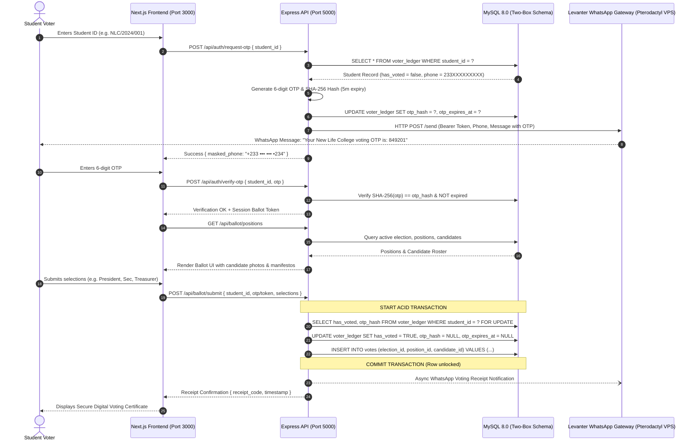

# Implementation Plan: Secure Student Voting System (New Life College)

Generate a production-ready, containerized Student Voting System for New Life College. The system replaces an insecure Google Forms workflow with a decoupled "Two-Box" architecture, row-level ACID transactions, and closed-loop WhatsApp One-Time Password (OTP) verification powered by an external Levanter WhatsApp Bot gateway.

---

## User Review Required

> [!IMPORTANT]
> **Levanter WhatsApp API Gateway Mode**: 
> The implementation provides a modular `LevanterService` supporting HTTP POST Bearer auth endpoints (`/send`, `/messages`, or custom endpoint). It includes an automatic **Mock / Dev Simulation Mode** (`LEVANTER_MOCK_MODE=true` or automatic fallback when the VPS is unreachable during development) that logs the 6-digit OTP clearly to the terminal and debug response, while seamlessly switching to live Pterodactyl WhatsApp delivery when credentials are provided in `.env`.

> [!NOTE]
> **Two-Box Data Schema Decoupling**:
> In accordance with strict cryptographic ballot secrecy, the `votes` table contains NO foreign keys, student IDs, phone numbers, or metadata that can link cast votes to entries in the `voter_ledger`.

---

## Architecture & Data Flow

---

## Proposed Changes

### 1. Database Layer (`database/`)

#### [NEW] [init.sql](file:///c:/Users/Cyran/Desktop/Project%20Work/database/init.sql)
- **`voter_ledger` table:** `student_id` (VARCHAR PK), `full_name`, `phone_number` (E.164 / Ghana 233 format), `has_voted` (BOOLEAN DEFAULT FALSE), `otp_hash` (VARCHAR 64), `otp_expires_at` (TIMESTAMP), `created_at`.
- **`elections` table:** `id`, `title`, `description`, `is_active`, `start_date`, `end_date`.
- **`positions` table:** `id`, `election_id`, `title`, `description`, `max_selections`, `display_order`.
- **`candidates` table:** `id`, `position_id`, `name`, `manifesto`, `avatar_url`, `display_order`.
- **`votes` table:** `vote_id` (BIGINT AUTO_INCREMENT PK), `election_id`, `position_id`, `candidate_id`, `ballot_hash` (CHAR 64), `created_at` (**STRICTLY ANONYMOUS - NO VOTER ID REFERENCE**).
- **`audit_logs` table:** `id`, `event_type`, `description`, `ip_address`, `created_at`.
- **Seed Data:** Active "2026/2027 New Life College Student Representative Council (SRC) General Elections" with positions (SRC President & Vice President, General Secretary, Financial Controller, Organizing Secretary, Women's Commissioner) and test candidates, plus pre-seeded student voter records for instant testing.

---

### 2. Backend Service (`backend/`)

#### [NEW] [package.json](file:///c:/Users/Cyran/Desktop/Project%20Work/backend/package.json)
- Express, TypeScript, `mysql2`, `cors`, `helmet`, `dotenv`, `zod`, `axios`, `express-rate-limit`, `morgan`, `ts-node-dev`, `@types/*`.

#### [NEW] [tsconfig.json](file:///c:/Users/Cyran/Desktop/Project%20Work/backend/tsconfig.json)
- Strict TypeScript configuration targeting Node 20/22.

#### [NEW] [Dockerfile](file:///c:/Users/Cyran/Desktop/Project%20Work/backend/Dockerfile)
- Multi-stage build (`builder` -> lightweight `node:alpine` runtime) with non-root security user.

#### [NEW] [src/config/db.ts](file:///c:/Users/Cyran/Desktop/Project%20Work/backend/src/config/db.ts)
- MySQL2 connection pool with automatic reconnection, promise support, connection health validation.

#### [NEW] [src/config/env.ts](file:///c:/Users/Cyran/Desktop/Project%20Work/backend/src/config/env.ts)
- Environment variable loader with type safety and fallback defaults.

#### [NEW] [src/services/levanter.ts](file:///c:/Users/Cyran/Desktop/Project%20Work/backend/src/services/levanter.ts)
- Modular Levanter WhatsApp Client:
  - International phone number cleaning & normalization (`233XXXXXXXXX` or `+233`).
  - Configurable endpoints (`/send`, `/messages`, `/send-message`) with Bearer token authentication.
  - Formatted OTP messages with college branding and security warnings.
  - Asynchronous voting confirmation delivery.
  - Resilient mock mode fallback for local offline testing.

#### [NEW] [src/services/crypto.ts](file:///c:/Users/Cyran/Desktop/Project%20Work/backend/src/services/crypto.ts)
- `crypto.randomInt(100000, 999999)` for secure OTP generation.
- SHA-256 hashing functions for OTP storage and verification.
- Anonymized ballot hash generation for voting receipts.

#### [NEW] [src/controllers/election.controller.ts](file:///c:/Users/Cyran/Desktop/Project%20Work/backend/src/controllers/election.controller.ts)
- `requestOtp`: Validates student, checks `!has_voted`, generates OTP, saves hash + 5m expiry, dispatches WhatsApp message, returns masked phone number.
- `verifyOtp`: Validates OTP against stored hash before proceeding.
- `getBallot`: Returns election positions and candidates.
- `submitBallot`: Executes ACID transaction with `SELECT ... FOR UPDATE` row-level lock on `voter_ledger`, sets `has_voted = TRUE`, inserts anonymous votes, triggers background WhatsApp confirmation.
- `getResults`: Real-time public election turnout and candidate vote counts.

#### [NEW] [src/routes/election.routes.ts](file:///c:/Users/Cyran/Desktop/Project%20Work/backend/src/routes/election.routes.ts)
- API routing with rate-limiting and validation middleware.

#### [NEW] [src/index.ts](file:///c:/Users/Cyran/Desktop/Project%20Work/backend/src/index.ts)
- Express server initialization, middleware setup, health checks, route registration, global error handling.

---

### 3. Frontend Next.js Application (`frontend/`)

#### [NEW] [package.json](file:///c:/Users/Cyran/Desktop/Project%20Work/frontend/package.json)
- Next.js 14/15, React 18/19, Tailwind CSS, Lucide React, Canvas Confetti, clsx, tailwind-merge.

#### [NEW] [Dockerfile](file:///c:/Users/Cyran/Desktop/Project%20Work/frontend/Dockerfile)
- Multi-stage Next.js production build (`node:alpine`).

#### [NEW] [app/layout.tsx](file:///c:/Users/Cyran/Desktop/Project%20Work/frontend/app/layout.tsx)
- Global layout with Google Font typography (Inter / Outfit), New Life College header badge, security encryption status bar, and footer.

#### [NEW] [app/page.tsx](file:///c:/Users/Cyran/Desktop/Project%20Work/frontend/app/page.tsx)
- Student Portal Login:
  - Step 1: Student ID entry with quick-test dropdown or manual input.
  - Step 2: Masked phone confirmation banner.
  - Step 3: 6-digit OTP input boxes with countdown timer and resend trigger.

#### [NEW] [app/ballot/page.tsx](file:///c:/Users/Cyran/Desktop/Project%20Work/frontend/app/ballot/page.tsx)
- Interactive Ballot Interface:
  - Position cards with progress indicator.
  - Candidate tiles with profile avatars, manifesto modals, and single-click selection.
  - Review & Confirmation dialog before final submission.
  - Double-submit prevention and loading state.

#### [NEW] [app/success/page.tsx](file:///c:/Users/Cyran/Desktop/Project%20Work/frontend/app/success/page.tsx)
- Official Digital Voting Certificate:
  - Animated celebration confetti.
  - Cryptographic anonymous ballot receipt code.
  - Printable receipt card with Print / Download button.
  - WhatsApp notification confirmation indicator.

#### [NEW] [app/results/page.tsx](file:///c:/Users/Cyran/Desktop/Project%20Work/frontend/app/results/page.tsx)
- Live Public Election Tally & Turnout Dashboard:
  - Voter turnout gauge (Percentage of total registered voters who cast their ballots).
  - Position-by-position real-time bar charts with lead indicators.

---

### 4. Orchestration & Configuration (`root`)

#### [NEW] [docker-compose.yml](file:///c:/Users/Cyran/Desktop/Project%20Work/docker-compose.yml)
- Multi-container orchestration for `db` (MySQL 8), `backend` (Express API), `frontend` (Next.js App).
- Internal network `voting_net`, persistent `db_data` volume, health checks.

#### [NEW] [.env.example](file:///c:/Users/Cyran/Desktop/Project%20Work/.env.example) & [.env](file:///c:/Users/Cyran/Desktop/Project%20Work/.env)
- Environment variables template with configuration for DB, backend port, frontend URL, and Levanter Pterodactyl VPS credentials.

#### [NEW] [README.md](file:///c:/Users/Cyran/Desktop/Project%20Work/README.md)
- Complete deployment manual, architecture diagram, API documentation, and Levanter VPS integration instructions.

---

## Verification Plan

### Automated & Unit Checks
- Compile & build TypeScript backend (`tsc --noEmit` and build test).
- Build Next.js frontend (`npm run build`).
- Validate MySQL DDL syntax and seed data integrity.

### Integration & End-to-End Testing
1. **Cluster Boot Test**: Run local instances or Docker containers.
2. **OTP Request & Closed-Loop Auth**:
   - Send `POST /api/auth/request-otp` for test student `NLC/2024/001`.
   - Verify phone number is not exposed in full (`+233 ••• ••• •234`).
   - Verify OTP is hashed in `voter_ledger` and WhatsApp dispatch is invoked.
3. **Atomic Ballot Casting & Row-Locking**:
   - Submit ballot for `NLC/2024/001`.
   - Confirm `voter_ledger.has_voted` is set to `TRUE`.
   - Confirm votes are recorded in `votes` table anonymously with zero relation to `student_id`.
   - Attempt a second submission for `NLC/2024/001` with same/new OTP -> Verify strict rejection with HTTP 403 / "Already Voted".
4. **Public Results & Turnout Verification**:
   - Check `/api/results` and `/results` page to ensure tallies match recorded votes.
