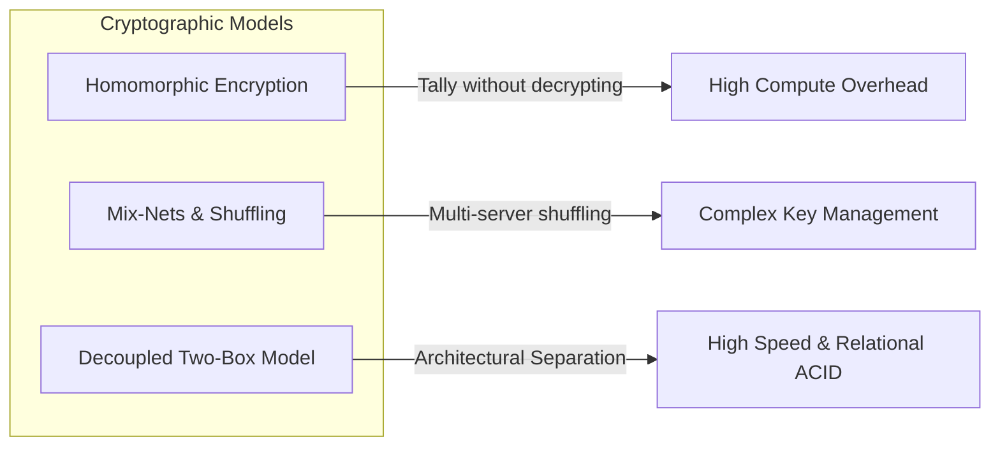
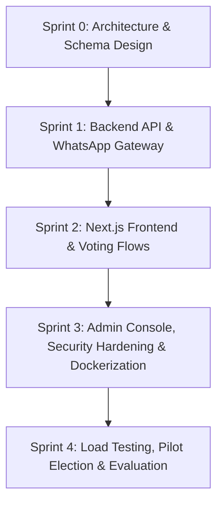
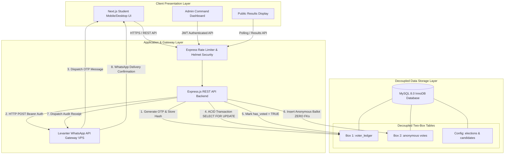

# PROJECT PROPOSAL

## DESIGN AND IMPLEMENTATION OF A CONTAINERIZED, CRYPTOGRAPHICALLY DECOUPLED E-VOTING SYSTEM WITH WHATSAPP OTP AUTHENTICATION FOR NEW LIFE COLLEGE

**Institution:** New Life College, Ghana  
**Department:** Department of Computer Science & Information Technology  
**Project Category:** Cybersecurity, Full-Stack Software Engineering, Distributed Systems  
**Target Platform:** Web Application (Responsive Mobile-First / Desktop)  
**Academic Year:** 2026/2027  

---

## Table of Contents

- [1.1 Introduction](#11-introduction)
- [1.2 Problem Statement](#12-problem-statement)
- [1.3 Aim](#13-aim)
- [1.4 Objective](#14-objective)
  - [1.4.1 Specific Objectives](#141-specific-objectives)
  - [1.4.2 Research Questions](#142-research-questions)
- [1.5 Significance of Project](#15-significance-of-project)
  - [1.5.1 Institutional Significance](#151-institutional-significance)
  - [1.5.2 Technological & Academic Significance](#152-technological--academic-significance)
  - [1.5.3 Socio-Democratic Significance](#153-socio-democratic-significance)
- [1.6 Justification of Project](#16-justification-of-project)
  - [1.6.1 Cost-Effectiveness & Logistical Viability](#161-cost-effectiveness--logistical-viability)
  - [1.6.2 Ubiquity and Reliability of WhatsApp Infrastructure](#162-ubiquity-and-reliability-of-whatsapp-infrastructure)
  - [1.6.3 Regulatory & Data Privacy Compliance](#163-regulatory--data-privacy-compliance)
- [1.7 Literature Review](#17-literature-review)
  - [1.7.1 Evolution of Democratic Voting Paradigms](#171-evolution-of-democratic-voting-paradigms)
  - [1.7.2 Electronic Voting Architectures: DRE vs. Internet Voting](#172-electronic-voting-architectures-dre-vs-internet-voting)
  - [1.7.3 Cryptographic Protocols and Ballot Anonymity Models](#173-cryptographic-protocols-and-ballot-anonymity-models)
  - [1.7.4 Out-of-Band (OOB) Authentication and Messaging Gateways](#174-out-of-band-oob-authentication-and-messaging-gateways)
  - [1.7.5 High-Concurrency Transaction Isolation & Row-Level Locking](#175-high-concurrency-transaction-isolation--row-level-locking)
  - [1.7.6 Comparative Matrix of Existing Electoral Solutions](#176-comparative-matrix-of-existing-electoral-solutions)
- [1.8 Proposed Methodology](#18-proposed-methodology)
  - [1.8.1 Software Development Lifecycle (SDLC) Model](#181-software-development-lifecycle-sdlc-model)
  - [1.8.2 System Architecture & Design](#182-system-architecture--design)
  - [1.8.3 Decoupled "Two-Box" Data Schema & Cryptographic Flow](#183-decoupled-two-box-data-schema--cryptographic-flow)
  - [1.8.4 Technical Stack & Implementation Frameworks](#184-technical-stack--implementation-frameworks)
  - [1.8.5 Testing, Verification & Quality Assurance Strategy](#185-testing-verification--quality-assurance-strategy)
  - [1.8.6 Project Schedule & Milestone Timeline](#186-project-schedule--milestone-timeline)
  - [1.8.7 Budgetary & Resource Requirements](#187-budgetary--resource-requirements)
- [1.9 Conclusion](#19-conclusion)

---

## 1.1 Introduction

Democratic student governance in higher education institutions serves as the bedrock for nurturing civic leadership, institutional accountability, and student advocacy. At **New Life College (NLC)**, the annual Student Representative Council (SRC) and departmental elections represent pivotal civic exercises where thousands of accredited undergraduate and diploma students elect executive officers to represent their academic, welfare, and social interests.

Historically, tertiary institutions across Sub-Saharan Africa, including Ghana, have managed student elections through manual, paper-based balloting systems. While paper voting is tangible, it introduces immense logistical overhead, high printing costs, vulnerabilities to ballot stuffing, prolonged manual counting, and recurring post-election collation disputes. In recent years, the accelerated digital transformation of academic administration spurred institutions to adopt online survey utilities, most notably Google Forms and Microsoft Forms, as stopgap solutions for student elections.

However, generic survey forms are fundamentally unsuited for statutory elections. They lack verifiable cryptographic anonymity, allow unrestricted link dissemination, fail to enforce rigorous Out-of-Band (OOB) voter identity verification, and store timestamped responses that directly correlate student profiles with ballot selections. 

To overcome these critical security, privacy, and operational challenges, this project introduces the **New Life College Containerized Student Voting System**. The system is an institutional-grade, zero-trust digital election platform engineered to guarantee **100% secret ballot anonymity** through a cryptographically decoupled **"Two-Box"** storage architecture, strict closed-loop voter authentication via a dedicated **Levanter WhatsApp One-Time Password (OTP) API Gateway**, atomic database concurrency protection (`SELECT ... FOR UPDATE`), and an accessible, high-contrast, responsive web interface built on **Next.js**, **Express.js**, **MySQL 8.0 InnoDB**, and **Docker Compose**.

---

## 1.2 Problem Statement

The electoral processes at New Life College currently face significant operational, security, and integrity vulnerabilities stemming from legacy paper balloting and ad-hoc digital survey tools:

1. **Vulnerability to Voter Impersonation and Proxy Voting:**  
   In paper-based voting, verifying student identity against printed physical photo albums in crowded polling stations is prone to human error and voter impersonation. Similarly, in generic Google Forms voting setups, students frequently share login credentials or form links, enabling unauthorized individuals or organized factions to cast proxy ballots on behalf of absent peers.

2. **Violation of Ballot Secrecy and Voter Anonymity:**  
   Standard survey platforms record response timestamps, IP addresses, and linked student email addresses alongside submitted choices. In small faculties or staggered voting windows, timestamp correlation analysis enables database administrators or electoral commissioners to trace specific votes back to individual students, destroying voter confidentiality and exposing students to social coercion or retribution.

3. **Concurrency Vulnerabilities, Race Conditions, and Double Voting:**  
   Generic web forms lack ACID-compliant pessimistic locking mechanisms. When hundreds of students submit votes simultaneously during peak voting hours, race conditions can allow multiple form submissions from the same student ID across multiple browser tabs or devices before the system updates the voter's participation status.

4. **Lack of Independent Voter Auditability:**  
   Traditional voting methods fail to provide voters with cryptographic proof that their ballot was accurately recorded in the tally without revealing the candidate choices within that ballot. Voters are forced to place blind trust in the electoral commission's manual tally.

5. **Logistical Inefficiencies and Protracted Collation Delays:**  
   Manual ballot sorting, physical ballot box transport, and hand-counting across multiple campus venues require substantial financial expenditure on paper ballots and security personnel, while delaying results announcements by hours or days, fostering suspicion and political tension among the student body.

---

## 1.3 Aim

The primary aim of this project is to **design, develop, evaluate, and deploy a secure, containerized, and privacy-preserving digital election system** for New Life College that guarantees mathematical ballot anonymity, eliminates duplicate voting via atomic concurrency control, and automates closed-loop voter authentication using a dedicated WhatsApp OTP gateway.

---

## 1.4 Objective

### 1.4.1 Specific Objectives

To achieve the stated aim, the project will pursue the following specific objectives:

1. **Analyze and Model Institutional Electoral Requirements:**  
   Conduct a thorough domain analysis of New Life College's electoral guidelines, faculty structures, voter accreditation workflows, and security requirements.

2. **Architect a Decoupled "Two-Box" Data Schema:**  
   Design and implement a relational database schema in MySQL 8.0 InnoDB separating voter identity (`voter_ledger`) from cast votes (`votes`) with **zero foreign keys**, preventing database-level linkage between voters and their ballots.

3. **Integrate Closed-Loop WhatsApp OTP Authentication:**  
   Develop a modular Out-of-Band messaging client interfacing with the **Levanter WhatsApp API Gateway** to generate cryptographically secure 6-digit numeric OTPs (`crypto.randomInt`), hash them with SHA-256, and dispatch them directly to pre-registered student phone numbers with a 5-minute time-to-live (TTL).

4. **Implement Pessimistic Concurrency & Transaction Isolation:**  
   Construct atomic database transaction handlers utilizing `SELECT ... FOR UPDATE` row-level locks to prevent double voting and race conditions during simultaneous ballot submissions.

5. **Engineer an Accessible, Responsive Voter Interface:**  
   Develop a mobile-first, high-contrast, WCAG AA-compliant frontend utilizing **Next.js (App Router)** and **Tailwind CSS**, themed to official New Life College branding (`#418CCD`, `#FFB606`, `#5EBB3E`, `#2A4856`, `#0E1E2E`) with full keyboard navigation and screen-reader accessibility.

6. **Develop an Electoral Commission Admin Console:**  
   Build a secured administrative dashboard featuring JWT-based role-based access control (RBAC), bulk Excel voter register ingestion, candidate nomination and manifesto management, voter accreditation approval queues, and real-time tally visualization.

7. **Implement Tamper-Evident Voter Audit Receipts:**  
   Generate unique cryptographic verification hashes (`SHA-256(timestamp + election_id + salt)`) and printable digital voting certificates dispatched via WhatsApp upon successful ballot submission.

8. **Containerize and Deploy via Docker:**  
   Package the entire multi-tier architecture (Database, Backend API, Frontend Web App) into isolated, production-grade Docker containers orchestrated via `docker-compose.yml` for zero-configuration, cross-platform deployment.

9. **Evaluate System Security, Performance, and Usability:**  
   Conduct load testing, penetration testing against the OWASP Top 10 vulnerabilities, and usability assessments utilizing the System Usability Scale (SUS).

### 1.4.2 Research Questions

This study will investigate and answer the following research questions:

1. *How can architectural decoupling in a relational database guarantee strict ballot secrecy while simultaneously enforcing that each accredited voter casts exactly one ballot?*
2. *What is the delivery reliability, latency, and cost-effectiveness of an Out-of-Band WhatsApp OTP gateway compared to legacy SMS aggregators in a Ghanaian university environment?*
3. *How effectively do database-level pessimistic row locks (`SELECT ... FOR UPDATE`) mitigate concurrency race conditions during high-volume election traffic spikes?*
4. *To what extent does instant cryptographic receipt issuance influence voter confidence and perceived election legitimacy among collegiate voters?*

---

## 1.5 Significance of Project

### 1.5.1 Institutional Significance
- **Elimination of Electoral Disputes:** Provides an immutable, auditable, and mathematically verifiable election ledger that eliminates accusations of ballot stuffing or rigged manual tallies.
- **Substantial Cost Reductions:** Drastically cuts expenditures associated with printing thousands of physical ballot papers, hiring indelible ink stations, constructing voting booths, and deploying physical ballot security personnel.
- **Accelerated Election Turnaround:** Delivers instant, real-time election results tabulation immediately upon poll closure, reducing post-election tension and administrative delays.

### 1.5.2 Technological & Academic Significance
- **Practical Application of Decoupled Cryptographic Architectures:** Demonstrates how academic and enterprise systems can implement Zero-Trust privacy patterns ("Two-Box" isolation) within standard relational databases without requiring complex homomorphic encryption or heavy blockchain infrastructure.
- **Novel Integration of WhatsApp API for Academic Authentication:** Provides an empirical case study on utilizing WhatsApp Web automation gateways (Levanter) as a reliable, cost-free alternative to volatile and expensive commercial SMS aggregators in West Africa.
- **Blueprint for African Higher Education Institutions:** Offers an open-source, containerized, and easily replicable digital voting infrastructure tailored to the technological realities and bandwidth constraints of African universities.

### 1.5.3 Socio-Democratic Significance
- **Enhanced Voter Engagement & Turnout:** Empowers off-campus, sandwich, evening, and working students to participate seamlessly in SRC governance from their smartphones or laptops without queuing for hours on campus.
- **Strengthening Democratic Culture:** Fosters high student trust in institutional processes and prepares future leaders through exposure to transparent, modern electoral technologies.

---

## 1.6 Justification of Project

### 1.6.1 Cost-Effectiveness & Logistical Viability
Traditional paper elections require printing thousands of multi-page ballot sheets, purchasing polling booths, procuring indelible ink, and providing stipends to dozens of polling agents and tally clerks. The proposed digital voting system requires only containerized hosting on a lightweight virtual private server (VPS), eliminating recurring material expenditures and scaling seamlessly across multiple concurrent departmental and SRC elections at zero incremental cost.

### 1.6.2 Ubiquity and Reliability of WhatsApp Infrastructure
In Ghana, mobile internet adoption among tertiary students is predominantly anchored on WhatsApp. While traditional SMS delivery suffers from telecommunication network filtering, delayed delivery queues (often 10 to 45 minutes during peak hours), and high per-SMS aggregator fees (GHS 0.05 – 0.12 per message), WhatsApp messages are delivered within 1 to 3 seconds with high reliability and zero per-message cost via the self-hosted Levanter API gateway. Furthermore, students can receive OTPs over campus Wi-Fi even when cellular airtime balance is zero.

### 1.6.3 Regulatory & Data Privacy Compliance
Under the **Ghana Data Protection Act, 2012 (Act 843)**, educational institutions are legally obligated to protect student data and guarantee privacy. Generic survey tools that record timestamped student IDs alongside voting preferences violate these data privacy mandates. By architecturally isolating student identification from anonymized vote records and utilizing SHA-256 hashing for OTPs and audit receipts, the proposed system ensures strict compliance with statutory data privacy principles.

---

## 1.7 Literature Review

### 1.7.1 Evolution of Democratic Voting Paradigms
The progression of democratic voting mechanisms spans four distinct historical epochs:
1. **Manual Paper Ballots:** The Australian secret ballot, introduced in the 1850s, established the standard for private voting booths. However, manual systems remain constrained by physical vulnerabilities, high logistical overhead, and slow collation.
2. **Mechanical & Punch-Card Systems:** Introduced in the mid-20th century to accelerate tallying, mechanical lever and punch-card machines suffered from mechanical jamming, ambiguous punch marks (e.g., the infamous 2000 US Presidential Election "hanging chads"), and lack of auditable trails.
3. **Direct Recording Electronic (DRE) Systems:** Introduced in the early 2000s, DRE touch-screen machines in physical polling centers eliminated manual counts but introduced vulnerabilities regarding closed-source software integrity, lack of voter-verifiable paper audit trails (VVPAT), and high hardware acquisition costs.
4. **Remote Internet Voting (I-Voting):** Pioneered nationally by Estonia in 2005, remote I-voting allows authenticated voters to cast ballots over public networks. Modern research in I-voting focuses on balancing two competing requirements: **individual verifiability** (voters verifying their vote was counted) and **ballot secrecy** (preventing anyone, including the system operator, from linking a voter to their ballot).

### 1.7.2 Electronic Voting Architectures: DRE vs. Internet Voting
Academic literature classifies electronic voting into supervised environments (DREs in controlled booths) and unsupervised environments (remote web/mobile voting). While supervised DREs minimize coercion risks, they fail to resolve long queues and off-campus student disenfranchisement. Internet voting addresses accessibility and geographic dispersion, provided strong multi-factor authentication and cryptographic anonymity are enforced.

### 1.7.3 Cryptographic Protocols and Ballot Anonymity Models
Preserving ballot secrecy while maintaining auditability is achieved through three primary architectural paradigms:



- **Homomorphic Encryption (e.g., Paillier, ElGamal):** Allows mathematical operations on encrypted ballots such that the sum of ciphertexts decrypts to the sum of votes. While mathematically elegant (used in Helios Voting), it imposes significant computational overhead on mobile client browsers and requires complex multi-authority threshold key management.
- **Mix-Nets (Chaumian Mixes):** Routes encrypted ballots through a sequence of independent servers that shuffle and re-encrypt the votes to break the communication chain. While effective, mix-nets introduce latency and require multiple untrusted servers operating across distinct administrative domains.
- **Decoupled "Two-Box" Physical & Logical Separation:** Deriving from the classic Fujioka-Okamoto-Ohta (FOO) and blind signature paradigms, the Two-Box model separates the **Registration Authority** (Box 1: Voter Identity & Participation Status) from the **Tallying Authority** (Box 2: Anonymous Ballot Storage). By strictly preventing any foreign keys, relational constraints, or correlated timestamps between the two tables, the database engine enforces zero-knowledge separation even under direct database inspection.

### 1.7.4 Out-of-Band (OOB) Authentication and Messaging Gateways
Multi-Factor Authentication (MFA) in remote voting protects against credential stuffing and stolen passwords. In university environments where students do not possess dedicated hardware security keys (e.g., YubiKeys), Out-of-Band (OOB) channels deliver short-lived One-Time Passwords (OTPs) to personal devices.

Comparative studies between **Short Message Service (SMS)** and **Instant Messaging Gateways (WhatsApp API)** demonstrate that WhatsApp provides:
- End-to-end TLS transport encryption between server and gateway.
- Faster delivery times (average < 2 seconds vs. 15–180 seconds for regional SMS).
- Elimination of telecom carrier SMS fees.
- Prevention of open-loop enumeration by requiring closed-loop server-side phone number lookup directly from the accredited voter register.

### 1.7.5 High-Concurrency Transaction Isolation & Row-Level Locking
During collegiate elections, voter arrival distributions exhibit extreme temporal clustering (spikes occurring immediately after morning announcements or during lunch breaks). Under standard optimistic concurrency control, simultaneous requests for the same voter ID can lead to **Lost Updates** or **Double Spending** (a voter casting two ballots simultaneously across two browser tabs).

Under MySQL InnoDB:
- **`READ COMMITTED` / `REPEATABLE READ` Isolation:** Ensures read consistency.
- **Pessimistic Row Locking (`SELECT ... FOR UPDATE`):** Acquires an exclusive write lock on the specific `voter_ledger` row, blocking subsequent concurrent requests until the active transaction commits or rolls back. This provides a mathematical guarantee of single-vote execution under arbitrary concurrent loads.

### 1.7.6 Comparative Matrix of Existing Electoral Solutions

| Feature / Criterion | Traditional Paper Voting | Google / MS Forms | Helios Voting | Commercial Portals | Proposed NLC System |
| :--- | :--- | :--- | :--- | :--- | :--- |
| **Ballot Anonymity** | High (Physical Booth) | ❌ Zero (Correlated) | ✅ High (Homomorphic) | Variable | ✅ **100% Decoupled Two-Box** |
| **Duplicate Prevention** | Manual (Ink/Marking) | Partial (1 response/Google) | ✅ Cryptographic Token | ✅ Database Check | ✅ **Atomic Concurrency Lock** |
| **Authentication Channel** | Physical Student ID | Google Account Sign-In | Email Link | SMS OTP | ✅ **Closed-Loop WhatsApp OTP** |
| **Deployment Complexity** | High Physical Logistics | Minimal | High (Crypto Keys) | High (SaaS License) | ✅ **One-Click Docker Compose** |
| **Real-Time Turnout Tally** | ❌ Manual Delay | Basic Spreadsheet | Complex Decryption | Dashboard | ✅ **Live Telemetry & Charts** |
| **Voter Audit Receipt** | ❌ None | Email Confirmation | Tracking Ciphertext | SMS Code | ✅ **SHA-256 WhatsApp Receipt** |
| **Cost per Election** | High (Printing/Labor) | Free (Non-compliant) | Moderate (Server) | High (Recurring SaaS) | ✅ **Zero Marginal Cost (VPS)** |

---

## 1.8 Proposed Methodology

### 1.8.1 Software Development Lifecycle (SDLC) Model
This project adopts the **Agile Scrum Methodology**, structured across four iterative 2-week sprints. Agile enables rapid prototyping, continuous security auditing, stakeholder feedback from the NLC Electoral Commission, and iterative usability refinements.



### 1.8.2 System Architecture & Design

The system implements a secure three-tier decoupled microservice architecture:



### 1.8.3 Decoupled "Two-Box" Data Schema & Cryptographic Flow

#### Data Schema Definition:
1. **`voter_ledger` (Box 1 - Identity & Accreditation):**
   - `student_id` (VARCHAR(50), Primary Key)
   - `full_name` (VARCHAR(150))
   - `department` (VARCHAR(100))
   - `level` (VARCHAR(20))
   - `phone_number` (VARCHAR(20), International format: `233XXXXXXXXX`)
   - `has_voted` (BOOLEAN, Default: FALSE)
   - `otp_hash` (VARCHAR(64), SHA-256, Nullable)
   - `otp_expires_at` (TIMESTAMP, Nullable)
   - `status` (ENUM: `'pending'`, `'approved'`, `'rejected'`)

2. **`votes` (Box 2 - Anonymous Ballot Vault):**
   - `vote_id` (INT AUTO_INCREMENT, Primary Key)
   - `election_id` (VARCHAR(50))
   - `position_id` (VARCHAR(50))
   - `candidate_id` (VARCHAR(50))
   - `created_at` (TIMESTAMP DEFAULT CURRENT_TIMESTAMP)
   - **Crucial Security Invariant:** The `votes` table contains **zero references, foreign keys, or hashes** pointing to `student_id`.

#### Atomic Ballot Submission Transaction Sequence:
```sql
-- Step 1: Begin strict ACID Transaction
START TRANSACTION;

-- Step 2: Acquire pessimistic exclusive row lock on voter
SELECT has_voted, otp_hash, otp_expires_at 
FROM voter_ledger 
WHERE student_id = :student_id 
FOR UPDATE;

-- Step 3: Validate in application layer:
-- If has_voted == TRUE OR otp_hash != SHA256(:input_otp) OR NOW() > otp_expires_at:
--     ROLLBACK and return error.

-- Step 4: Mark voter as voted & invalidate OTP
UPDATE voter_ledger 
SET has_voted = TRUE, otp_hash = NULL, otp_expires_at = NULL 
WHERE student_id = :student_id;

-- Step 5: Insert anonymized candidate selections
INSERT INTO votes (election_id, position_id, candidate_id) 
VALUES (:election_id, :position_id, :candidate_id);

-- Step 6: Commit atomic transaction
COMMIT;
```

### 1.8.4 Technical Stack & Implementation Frameworks

| Layer / Component | Technology Selected | Rationale & Justification |
| :--- | :--- | :--- |
| **Frontend Framework** | Next.js 14+ (App Router, React 18) | Server-side rendering, lightning-fast client transitions, TypeScript safety. |
| **Styling & Design System** | Tailwind CSS & Vanilla CSS | Full control over design tokens, official NLC color palette, WCAG AA compliance. |
| **Backend Runtime** | Node.js (v20 LTS) & Express.js | High-throughput asynchronous I/O, robust ecosystem, native cryptographic libraries. |
| **Language** | TypeScript (Strict Mode) | Compile-time type safety preventing runtime null pointer exceptions across API boundaries. |
| **Database Engine** | MySQL 8.0 with InnoDB Engine | Proven ACID compliance, row-level pessimistic locking, foreign key integrity. |
| **WhatsApp API Gateway** | Levanter WhatsApp Bot (API Mode) | Self-hosted Baileys-based WhatsApp gateway with Bearer authentication, zero per-message cost. |
| **Container Orchestration** | Docker & Docker Compose | Guaranteed environmental parity across development, staging, and production VPS. |
| **Cryptography** | Node.js native `crypto` module | CSPRNG for 6-digit OTP generation (`crypto.randomInt`), SHA-256 hashing. |

### 1.8.5 Testing, Verification & Quality Assurance Strategy

The system will undergo four rigorous validation phases:


1. **Unit & Integration Testing:**  
   Automated Jest and Supertest test suites covering API endpoints, OTP hashing algorithms, phone number sanitization, and input validation schemas.
2. **Concurrency & Load Stress Testing:**  
   Simulating 500 to 2,000 concurrent voting requests within a 60-second burst using **Artillery** and **Apache JMeter** to verify that zero race conditions or double-voting anomalies occur under maximum load.
3. **Security Audits & Penetration Testing:**  
   Verifying immunity against the OWASP Top 10 vulnerabilities (SQL Injection, Cross-Site Scripting (XSS), Cross-Site Request Forgery (CSRF), Broken Access Control, and Rate-Limiting bypasses).
4. **Pilot Election & Usability Evaluation:**  
   Conducting a controlled pilot election with 100 sample students representing different departments and evaluating voter satisfaction using the standardized 10-item **System Usability Scale (SUS)**.

### 1.8.6 Project Schedule & Milestone Timeline

| Phase / Milestone | Deliverables | Duration | Estimated Completion |
| :--- | :--- | :--- | :--- |
| **Phase 1: Requirements & Architecture** | Project Proposal, System SRS, Database DDL (`init.sql`), Architecture Diagrams | 2 Weeks | Week 2 |
| **Phase 2: Backend API & Gateway** | Express REST API, Levanter WhatsApp Client, ACID Lock Transactions, Auth Routes | 3 Weeks | Week 5 |
| **Phase 3: Frontend Client & Admin UI** | Next.js Voting Pages, OTP Keyboard Inputs, Ballot Interface, Admin Dashboard | 3 Weeks | Week 8 |
| **Phase 4: Docker Containerization** | Multi-stage Dockerfiles, Docker Compose configuration, Environment isolation | 1 Week | Week 9 |
| **Phase 5: Testing, Security & Load Audits**| Concurrency stress testing, Jest integration tests, OWASP penetration review | 2 Weeks | Week 11 |
| **Phase 6: Pilot Deployment & Final Report**| Pilot live deployment, SUS usability survey analysis, Final Project Dissertation | 3 Weeks | Week 14 |

### 1.8.7 Budgetary & Resource Requirements

| Resource Item | Description / Specification | Quantity | Estimated Cost (GHS) |
| :--- | :--- | :--- | :--- |
| **Cloud Virtual Private Server (VPS)** | 4 vCPU, 8GB RAM, 100GB SSD (Ubuntu 22.04 LTS) for Docker Cluster | 1 Year | GHS 1,200.00 |
| **Dedicated WhatsApp Gateway VPS** | 2 vCPU, 4GB RAM Pterodactyl Container for Levanter Bot | 1 Year | GHS 600.00 |
| **Domain & SSL Certificate** | Institutional Subdomain (`vote.newlifecollege.edu.gh`) & Let's Encrypt Wildcard SSL | 1 | GHS 0.00 (Institution Provided) |
| **Dedicated WhatsApp SIM & Data** | Dedicated Telco SIM card with active data bundle for gateway uptime | 1 | GHS 350.00 |
| **Development & Testing Hardware** | Workstations, mobile test devices (Android / iOS), testing routers | — | Existing Hardware |
| **Total Estimated Budget** | — | — | **GHS 2,150.00** |

---

## 1.9 Conclusion

The integrity, security, and accessibility of student elections are fundamental to maintaining trust and active participation in university democratic governance. The current reliance on manual paper ballots or insecure generic survey forms at New Life College creates severe vulnerabilities regarding voter impersonation, privacy breaches, concurrency race conditions, and protracted tabulation disputes.

This proposed project addresses these critical challenges by engineering an institutional-grade, containerized digital voting system. By synergizing a **cryptographically decoupled "Two-Box" storage architecture**, **closed-loop WhatsApp OTP authentication**, **pessimistic row-level ACID transactions**, and an **accessible, high-contrast user interface**, the system guarantees that:
1. Every accredited student can vote exactly once without physical or technical barriers.
2. It is mathematically and architecturally impossible to link any ballot to a student's identity.
3. Election results are computed instantaneously, transparently, and immutably upon poll closure.

The successful implementation and deployment of this platform will modernize New Life College's democratic processes, drastically reduce election operational expenses, protect student data privacy under statutory regulations, and establish an extensible technological blueprint for digital election integrity across African tertiary institutions.
