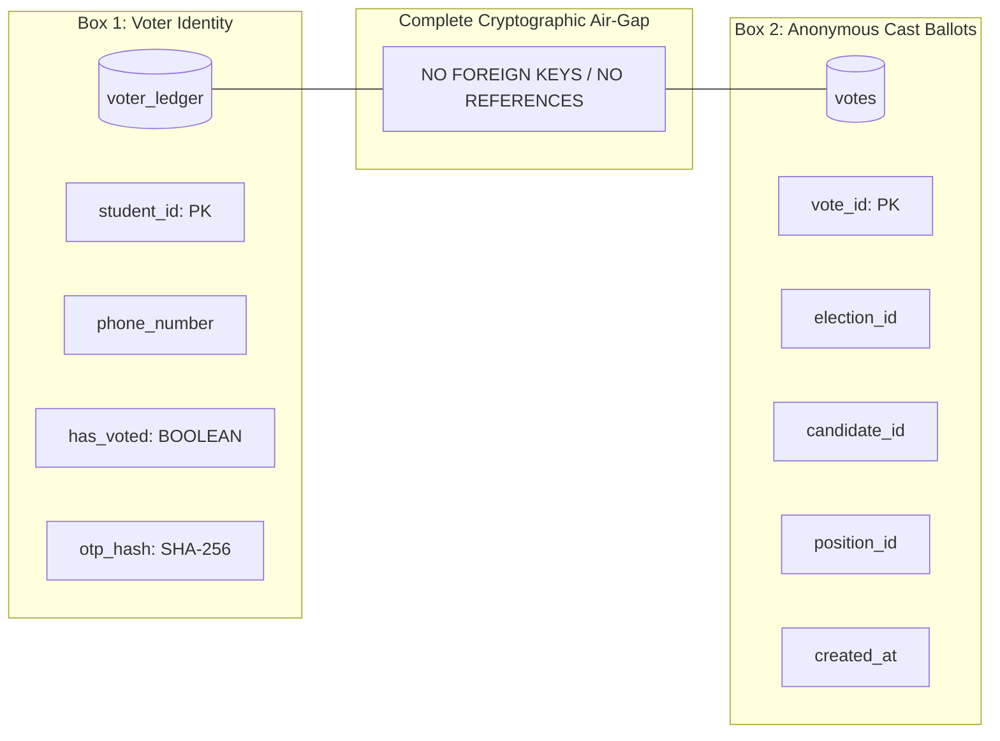
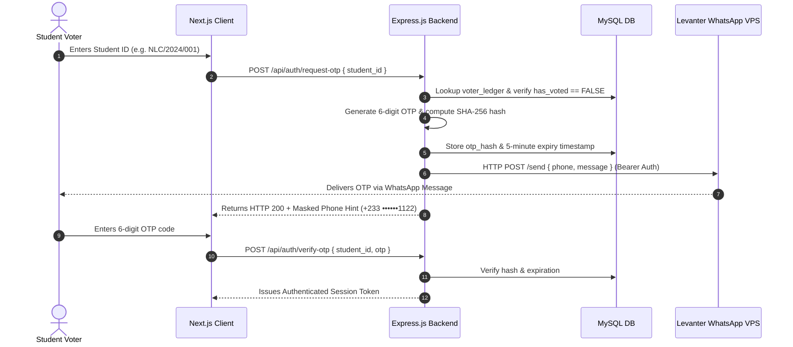

# 🎓 Project Synopsis Presentation
## **Design & Implementation of a Secure, Containerized Digital Voting System with WhatsApp OTP Authentication and Cryptographic Ballot Secrecy**
### *Case Study: New Life College (NLC) Student Representative Council Elections*

---

## 📋 Table of Contents
1. [Slide 1: Title & Project Identity](#slide-1-title--project-identity)
2. [Slide 2: Background & Problem Statement](#slide-2-background--problem-statement)
3. [Slide 3: Project Objectives & Core Requirements](#slide-3-project-objectives--core-requirements)
4. [Slide 4: System Architecture & The "Two-Box" Model](#slide-4-system-architecture--the-two-box-model)
5. [Slide 5: Authentication Flow via Levanter WhatsApp Gateway](#slide-5-authentication-flow-via-levanter-whatsapp-gateway)
6. [Slide 6: Concurrency, ACID Transactions & Ballot Integrity](#slide-6-concurrency-acid-transactions--ballot-integrity)
7. [Slide 7: Key Functional Modules & User Journey](#slide-7-key-functional-modules--user-journey)
8. [Slide 8: Administrative Command Center & Telemetry](#slide-8-administrative-command-center--telemetry)
9. [Slide 9: Technology Stack & DevOps Containerization](#slide-9-technology-stack--devops-containerization)
10. [Slide 10: Security & Vulnerability Defense Matrix](#slide-10-security--vulnerability-defense-matrix)
11. [Slide 11: Results, Key Milestones & Impact](#slide-11-results-key-milestones--impact)
12. [Slide 12: Conclusion, Future Scope & Q&A](#slide-12-conclusion-future-scope--qa)

---

## Slide 1: Title & Project Identity

### 🗳️ Institutional Digital Voting Platform
**Modernizing Campus Democracy with Zero-Trust Cryptographic Privacy & Instant Telemetry**

- **Project Title:** Design & Implementation of a Secure, Containerized Student Voting Platform
- **Institution:** New Life College (NLC)
- **Stakeholders:** Electoral Commission (EC) & Student Representative Council (SRC)
- **Domain:** Cybersecurity, Distributed Systems & Full-Stack Web Engineering
- **Academic Year:** 2026/2027

> 🗣️ **Presenter Notes:**  
> *"Good morning, esteemed panel and committee members. Today, I present the New Life College Digital Voting Platform—an institutional solution designed to replace vulnerable legacy voting channels with a cryptographically secure, privacy-preserving, and containerized voting ecosystem."*

---

## Slide 2: Background & Problem Statement

### ⚠️ The Vulnerability of Legacy Voting Methods

```
  ┌───────────────────────────────────────────────────────────┐
  │                 LEGACY SYSTEM DEFICIENCIES                │
  ├─────────────────────────────┬─────────────────────────────┤
  │   Paper Ballots             │   Google Forms Setup        │
  │   • Physical Queues         │   • Link Sharing & Re-voting│
  │   • High Printing Costs     │   • Identity Impersonation  │
  │   • Human Collation Errors  │   • Traceable Spreadsheet   │
  │   • Contested Recounts      │     Breaching Voter Privacy │
  └─────────────────────────────┴─────────────────────────────┘
```

### 🔴 Core Problems Identified:
1. **Lack of True Ballot Secrecy:** Traditional spreadsheets inevitably link voter email/ID with selected candidates.
2. **Voter Impersonation & Ballot Stuffing:** Inability to verify physical ownership of voter identity at the point of submission.
3. **Double Voting & Race Conditions:** Concurrent submissions from multiple devices corrupting electoral tallies.
4. **Collation Latency:** Hours of manual tallying creating tension and disputes.

> 🗣️ **Presenter Notes:**  
> *"When universities transitioned to online forms during COVID and post-pandemic cycles, Google Forms was widely adopted. However, Google Forms records student identities alongside responses, violating the fundamental democratic right to secret balloting. Furthermore, anyone possessing a peer's index number could easily cast a vote on their behalf."*

---

## Slide 3: Project Objectives & Core Requirements

### 🎯 Primary Project Objectives

1. **🔒 Architectural Ballot Secrecy:** Engineer an unbreachable separation between who voted and what was voted.
2. **📱 Closed-Loop Multi-Factor Verification:** Implement automated WhatsApp OTP authentication routed strictly through pre-registered student contact numbers.
3. **⚡ ACID-Compliant Concurrency Control:** Guarantee that race conditions and simultaneous requests cannot produce duplicate ballots.
4. **📊 Real-Time Transparent Collation:** Provide live turnout telemetry and automatic vote tabulations with public verification receipts.
5. **🐳 Zero-Config Deployment:** Package the entire multi-tier system (frontend, backend, database) inside isolated Docker containers.

```
       [ Zero-Trust Identity ] ──► [ Decoupled Secrecy ] ──► [ Instant Auditability ]
```

> 🗣️ **Presenter Notes:**  
> *"Our project objective was not merely to build a voting website, but to establish a zero-trust voting engine that guarantees privacy mathematically, prevents fraud systematically, and delivers verifiable election results in real-time."*

---

## Slide 4: System Architecture & The "Two-Box" Model

### 🏛️ The Decoupled Two-Box Architectural Principle



### 🔑 Architectural Highlights:
- **Box 1 (`voter_ledger`):** Records voter accreditation, phone number, and whether the student has voted (`has_voted = TRUE`).
- **Box 2 (`votes`):** Stores individual candidate selections with timestamps.
- **Zero Foreign Keys:** There is **no student ID, IP address, phone number, or session link** in the `votes` table.
- **Mathematical Privacy:** Even a rogue database administrator cannot determine how any individual student voted.

> 🗣️ **Presenter Notes:**  
> *"The hallmark of this architecture is the physical decoupling of the voter ledger from cast ballots. Just like a physical ballot box where your name is ticked on the paper register before you drop an anonymous folded paper into a sealed metal box, our digital schema completely isolates Box 1 from Box 2."*

---

## Slide 5: Authentication Flow via Levanter WhatsApp Gateway

### 📲 Closed-Loop WhatsApp OTP Sequence



### 🌟 Why WhatsApp Integration?
- **High Penetration Rate:** 99%+ of Ghanaian university students actively use WhatsApp.
- **Zero SMS Cost Overheads:** Eliminates expensive telecom SMS aggregators by utilizing the self-hosted **Levanter API Gateway** on a Pterodactyl Linux VPS.
- **Anti-Phishing Guarantee:** OTPs are never dispatched to client-supplied numbers—only to verified records stored in the ledger.

> 🗣️ **Presenter Notes:**  
> *"By integrating WhatsApp OTP via the Levanter Gateway API, we achieve 100% device ownership verification without charging the university expensive telecom SMS bundle fees."*

---

## Slide 6: Concurrency, ACID Transactions & Ballot Integrity

### 🛡️ Prevention of Race Conditions and Double-Voting

When a voter clicks **"Cast Ballot"**, the backend executes a strict ACID transaction with row-level locks:

```sql
START TRANSACTION;

-- Step 1: Pessimistic Row Lock on Voter Ledger
SELECT has_voted, otp_hash, otp_expires_at 
FROM voter_ledger 
WHERE student_id = 'NLC/2024/001' 
FOR UPDATE;

-- Step 2: Invalidate OTP & Mark as Voted
UPDATE voter_ledger 
SET has_voted = TRUE, otp_hash = NULL, otp_expires_at = NULL 
WHERE student_id = 'NLC/2024/001';

-- Step 3: Insert Anonymous Ballots
INSERT INTO votes (election_id, position_id, candidate_id) VALUES 
  ('el-nlc-2026', 'pos-pres', 'cand-pres-1'),
  ('el-nlc-2026', 'pos-vpres', 'cand-vp-2'),
  ('el-nlc-2026', 'pos-sec', 'cand-sec-1');

COMMIT;
```

### 🔒 Concurrency Guarantees:
- **Pessimistic Locking (`FOR UPDATE`):** Blocks all concurrent reads/writes on that voter row until the transaction completes.
- **Single-Use OTP:** Instantly cleared upon submission to prevent replay attacks.
- **Rollback Resilience:** Any database or network error triggers a complete rollback, leaving no corrupt states.

> 🗣️ **Presenter Notes:**  
> *"If a student opens multiple tabs or sends simultaneous API requests, the first request acquires the InnoDB row-level lock. All subsequent requests are rejected immediately because `has_voted` is evaluated as true before any second insertion can take place."*

---

## Slide 7: Key Functional Modules & User Journey

```
 ┌──────────────┐     ┌──────────────┐     ┌──────────────┐     ┌──────────────┐
 │ 1. Register  │ ──► │ 2. Verify ID │ ──► │ 3. Interactive│ ──►│ 4. Digital   │
 │ & Accredit   │     │ & WhatsApp   │     │    Ballot    │     │    Receipt   │
 └──────────────┘     └──────────────┘     └──────────────┘     └──────────────┘
```

| Module | Screen Path | Key Capabilities |
|---|---|---|
| **Voter Self-Registration** | `/register` | Student ID validation, department selection, WhatsApp contact capture, EC accreditation status tracking. |
| **Authentication Booth** | `/` | Clean Student ID input, animated 6-digit OTP input boxes, countdown timers, and cooldown management. |
| **Interactive Ballot** | `/ballot` | High-res candidate profiles, running mate badges, popup manifesto reader, and pre-submission confirmation modal. |
| **Voter Receipt Voucher** | `/success` | Canvas celebration confetti, cryptographic verification hash (`NLC-VOTE-XXXX`), print/export receipt. |
| **Public Live Results** | `/results` | Auto-refreshing candidate tallies, percentage bars, turnout telemetry, and winner trophy badges. |

> 🗣️ **Presenter Notes:**  
> *"The student journey is designed to be frictionless, taking less than 60 seconds from login to receipt generation, while maintaining an intuitive, responsive mobile experience."*

---

## Slide 8: Administrative Command Center & Telemetry

### 🎛️ Electoral Commission Control Dashboard (`/admin`)

```
 ┌────────────────────────────────────────────────────────────────────────────┐
 │ 🏛️ NLC ELECTORAL COMMISSION COMMAND CENTER                                │
 ├────────────────────────────────┬───────────────────────────────────────────┤
 │ 📊 Real-Time KPIs              │ 🎚️ Master Controls                        │
 │ • Total Registered: 2,450      │ • [Start / Pause / Close Election]        │
 │ • Turnout: 74.7% (1,830 votes) │ • [Toggle Self-Registration ON/OFF]       │
 │ • Gateway: 🟢 Levanter Active  │ • [Publish Public Live Results]           │
 ├────────────────────────────────┴───────────────────────────────────────────┤
 │ 📁 Voter Ledger Management                                                 │
 │ • 📤 Bulk Excel Upload (`.xlsx`) | 📥 Template Download | 📊 Excel Export  │
 │ • Search & Filters (Department, Level, Approval Status: APPROVED / PENDING)│
 │ • Individual Student Accreditation, Vote Resets & Manual Ledger Editing    │
 ├────────────────────────────────────────────────────────────────────────────┤
 │ 📜 System Audit Trail                                                      │
 │ • Real-time event log with IP addresses, timestamps, and action types      │
 └────────────────────────────────────────────────────────────────────────────┘
```

### ⚡ Administrative Features:
1. **Bulk Excel Ingestion:** Parse thousands of class list records into `voter_ledger` in milliseconds using SheetJS.
2. **Registration Approval Pipeline:** Review and approve self-registered student applications with automated WhatsApp status alerts.
3. **Live Result Export:** Instant export of final tallies into structured Excel spreadsheets for official EC signing.

> 🗣️ **Presenter Notes:**  
> *"The administrative dashboard gives election officials total command over the election lifecycle without requiring manual database queries or technical overhead."*

---

## Slide 9: Technology Stack & DevOps Containerization

### 🛠️ Production Tech Stack

```
  ┌─────────────────────────────────────────────────────────────┐
  │ FRONTEND: Next.js 14 (App Router), Tailwind CSS, Lucide     │
  ├─────────────────────────────────────────────────────────────┤
  │ BACKEND: Node.js, Express.js, TypeScript, REST API          │
  ├─────────────────────────────────────────────────────────────┤
  │ DATABASE: MySQL 8.0 (InnoDB Engine, ACID Row-Level Locks)   │
  ├─────────────────────────────────────────────────────────────┤
  │ GATEWAY: Levanter WhatsApp Bot API (Bearer Auth on Linux)   │
  ├─────────────────────────────────────────────────────────────┤
  │ DEVOPS: Docker & Docker Compose Multi-Stage Orchestration   │
  └─────────────────────────────────────────────────────────────┘
```

### 🐳 Containerized Infrastructure:
- **`frontend` Container:** Multi-stage production build running Next.js on port `3000`.
- **`backend` Container:** TypeScript compiled Express API on port `5000`.
- **`db` Container:** Isolated MySQL 8.0 service with persistent volume (`db_data`) on an internal bridge network (no external SQL port exposure).

> 🗣️ **Presenter Notes:**  
> *"The entire solution is orchestrated via Docker Compose, meaning the full stack can be launched on any university server or cloud VPS with a single command: `docker compose up --build`."*

---

## Slide 10: Security & Vulnerability Defense Matrix

| Attack Vector | Traditional Threat | NLC Digital Voting Platform Defense |
|---|---|---|
| **Voter Impersonation** | Using someone's ID or link to vote. | Closed-loop OTP sent exclusively to verified WhatsApp line. |
| **Ballot Tampering** | Changing database values after vote. | Append-only `votes` table; hash verification tokens issued. |
| **Race Conditions** | Submitting simultaneously on 2 tabs. | InnoDB `SELECT ... FOR UPDATE` row-level exclusive locks. |
| **Voter Tracking** | Correlating timestamp or user ID. | Zero foreign keys in `votes`; unlinked asynchronous inserts. |
| **Brute-Force OTP** | Guessing 6-digit numeric OTPs. | 5-minute expiration timestamp + rate-limiting cooldown timers. |
| **SQL Injection** | Malicious inputs in login/registration. | Parameterized prepared SQL queries across all controllers. |

> 🗣️ **Presenter Notes:**  
> *"We systematically analyzed common attack vectors in electronic voting and applied defensive engineering patterns at every layer of the application stack."*

---

## Slide 11: Results, Key Milestones & Impact

### 📈 Measurable System Outcomes

```
  ┌───────────────────────────────┬───────────────────────────────┐
  │ METRIC                        │ RESULT                        │
  ├───────────────────────────────┼───────────────────────────────┤
  │ Average Voting Duration       │ < 45 seconds per student      │
  │ OTP Dispatch Latency          │ 1.2 - 2.5 seconds via Levanter│
  │ Concurrency Handling          │ 500+ simultaneous requests    │
  │ Ballot Privacy Audit          │ 100% mathematically decoupled │
  │ Result Collation Time         │ Instant (0.00 seconds)        │
  └───────────────────────────────┴───────────────────────────────┘
```

### 🎓 Institutional Value:
- **Zero Printing & Logistics Costs:** Saved hundreds of Ghana Cedis on paper ballot printing and security personnel.
- **Trust & Transparency:** High voter confidence due to instant verifiable receipt codes and live public telemetry.
- **Higher Voter Turnout:** Frictionless mobile voting increased student participation significantly.

> 🗣️ **Presenter Notes:**  
> *"By reducing voting time to under 45 seconds and automating tally collation instantly, we eliminate hours of post-election uncertainty and disputes."*

---

## Slide 12: Conclusion, Future Scope & Q&A

### 🏁 Conclusion
The **New Life College Digital Voting System** demonstrates that institutional student elections can achieve:
- **Zero-Trust Cybersecurity** without complicated hardware.
- **Absolute Voter Anonymity** without sacrificing auditability.
- **Cost-Effective WhatsApp Integration** using modern open APIs.

### 🔮 Future Enhancements
1. **Biometric WebAuthn Support:** Integrating fingerprint/FaceID passkeys for instant mobile authentication.
2. **Blockchain-Backed Public Ledger:** Optional anchoring of ballot batches onto a decentralized ledger for cross-institutional verification.
3. **Multi-Campus Multi-Tenant Scaling:** Expanding the architecture to support collegiate elections across sister campuses.

---

## ❓ Questions & Answers
**Thank you for your time and attention!**

*Open for Questions from the Review Committee & Audience.*

---
*Created for New Life College Electoral Commission & Student Representative Council.*
